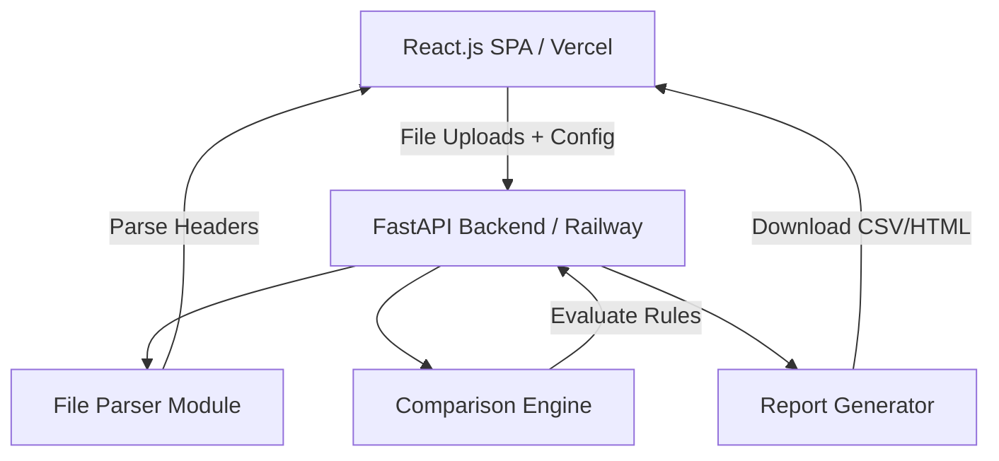

# ⚙️ DataMatchX

> **Multi-format data comparison & validation engine** — Compare CSV, JSON, XML, PSV, and Excel files using an interactive column mapping engine. Get instant cell-by-cell side-by-side diff reports and downloadable spreadsheet reports.

---

## 🎨 Premium Features

- 📂 **Multi-Format Support**: CSV, JSON, XML, PSV (pipe-separated), XLSX, and XLS.
- ⚛️ **Modern React.js + Vite SPA**: Beautiful dark glassmorphism interface with drag-and-drop loaders, smooth micro-animations, and dynamic page routing.
- 🗺️ **Interactive Visual Mapping Builder**: Parse uploaded datasets dynamically and visually pair columns, select matching rules, and customize tolerances on-the-fly.
- ⚡ **Smart Auto-Map Engine**: Automatically detects matching column pairings based on normalized string similarity, assigns join keys, and configures numeric tolerance rules for financial fields.
- ⚠️ **Real-Time Unmapped Indicators**: Visually highlights unmatched columns with a warm amber pulse glow and sleek `⚠️ Unmapped` tags so users never miss a field.
- 🔍 **GitHub-Style Side-by-Side Diffing**: Expand mismatched rows inline to see detailed Red (Source) vs Green (Target) cell differences, highlighting exact drift and numeric variance.
- 📊 **Rich Spreadsheet Reports**: Download full comparison results as styled **CSV** or standalone **HTML** reports.
- 🌐 **Robust FastAPI Backend**: High-performance asynchronous REST API with Swagger documentation and CORS support.

---

## 🛠️ Tech Stack & Architecture



### Backend
- **Core**: Python, FastAPI, Uvicorn
- **Engine**: Pandas (data alignment and vector calculations)
- **Validation**: Pydantic v2 schemas

### Frontend
- **Framework**: React.js 18, Vite 8 (extremely fast builds)
- **Styles**: Vanilla CSS (Tailored dark glassmorphism & fluid HSL system)
- **Icons**: Lucide React

---

## 🚀 Setup & Installation

### 1. Backend Server Setup

```bash
# Navigate to the backend directory
cd backend

# Install dependencies
pip install -r requirements.txt

# Start the development server
uvicorn app.main:app --reload --host 0.0.0.0 --port 8000
```
- **Backend Home**: `http://localhost:8000`
- **Interactive Swagger Docs**: `http://localhost:8000/docs`

---

### 2. Frontend App Setup

```bash
# Navigate to the frontend directory
cd frontend

# Install package dependencies
npm install

# Start Vite React development server
npm run dev
```
- **Local Application Access**: `http://localhost:5173` (or `5174`)

---

## ☁️ Production Deployments

The project is structured as a monorepo for effortless multi-platform cloud deployments:

- **Frontend Deployment (Vercel)**: Configured with a root-level [package.json](file:///e:/DataMatch-X/package.json) prefix-build command and custom [vercel.json](file:///e:/DataMatch-X/vercel.json) output routing.
  - URL: `https://datamatch-x.vercel.app` (or your custom vercel domain)
- **Backend Deployment (Railway)**: Dockerized and served directly using automated pipeline builds.
  - URL: `https://datamatch-x-production.up.railway.app`

---

## ⚙️ Column Comparison Rules

| Rule | Description | Configuration Parameters |
|---|---|---|
| `exact` | String equality (exact characters) | None |
| `case_insensitive` | Case-insensitive string match | None |
| `numeric_tolerance` | Absolute difference is within tolerance limit: `|src - tgt| <= tolerance` | `tolerance` (Float, e.g., `0.1` or `500.0`) |
| `regex` | Values must fit a regular expression pattern | `pattern` (String, e.g., `^\d{3}-\d{2}-\d{4}$`) |
| `ignore` | Ignores/skips the column during cell diff analysis | None |

---

## 🌐 API Reference

| Method | Endpoint | Description |
|---|---|---|
| `POST` | `/api/parse-headers` | Parse column headers dynamically from an uploaded file (CSV, XML, JSON, etc.) |
| `POST` | `/api/compare` | Run a full comparison using source + target files + a custom mapping definition |
| `POST` | `/api/validate` | Dry-run validate a mapping configuration against source and target files |
| `GET` | `/api/report/{id}` | Fetch a completed comparison report by ID |
| `GET` | `/api/report/{id}/csv` | Download the comparison report as a CSV spreadsheet |
| `GET` | `/api/report/{id}/html` | Download the comparison report as a rich styled HTML page |
| `GET` | `/api/reports` | List all stored report IDs |
| `GET` | `/health` | API system health check |

---

## 📂 Project Structure

```
DataMatch-X/
├── backend/
│   ├── app/
│   │   ├── main.py              # FastAPI Application Entry
│   │   ├── config.py            # System Configuration & Settings
│   │   ├── api/routes.py        # REST API Route Definitions
│   │   ├── core/
│   │   │   ├── parser.py        # Multi-Format File Parser
│   │   │   ├── mapper.py        # Mapping Loader & Validator
│   │   │   ├── comparator.py    # Core Comparison & Alignment Engine
│   │   │   └── reporter.py      # CSV/HTML Report Exporters
│   │   └── models/schemas.py    # Pydantic Request/Response Models
│   ├── sample_data/             # Example files for instant testing
│   │   ├── source_employees.csv
│   │   ├── target_employees.xml
│   │   └── mapping_csv_to_xml.json
│   └── requirements.txt
├── frontend/
│   ├── src/
│   │   ├── components/
│   │   │   ├── UploadZone.jsx   # Drag-and-drop handles
│   │   │   ├── InteractiveMapper.jsx # Visual Column Configurator
│   │   │   └── ResultRow.jsx    # Collapsible Side-by-Side Cell Diffs
│   │   ├── App.jsx              # App Layout & State Bindings
│   │   ├── index.css            # Dark glassmorphism stylesheet
│   │   ├── config.js            # Environment API Base Router
│   │   └── main.jsx             # React SPA mounting point
│   ├── index.html               # Main template structure
│   ├── vite.config.js           # Vite server parameters
│   └── package.json             # React dependencies & scripts
├── package.json                 # Monorepo root build script for Vercel
├── vercel.json                  # Vercel SPA build & router output redirection
├── Dockerfile                   # Railway Docker configuration
└── README.md                    # Core project documentation
```
